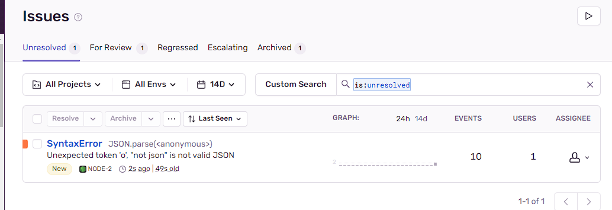
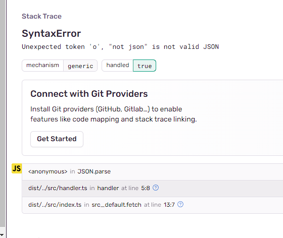

Sentry is important when you want to get notified on errors happening on your serverless platform in real time.

# Prerequisite:

1. Sign up for Sentry: (Requires a business email)

https://sentry.io/

`New Account > Welcome to Sentry`

2. Install Sentry - Select `NODE.JS` as the platform (You are not really installing anything to your computer it's just setting up the sentry)

https://YOURORGNAME.sentry.io/onboarding/select-platform/

3. Copy your DSN link from the code there some where, should look like this:
https://YOUR@DSN.ingest.de.sentry.io/LINK

4. and go to Settings > Auth Tokens and click Create New Token named `main` for example:

https://YOURORGNAME.sentry.io/settings/auth-tokens/

`sntrys_YOUR_TOKEN_WILL_LOOK_LIKE_THIS`

5. By now you should have the following information about your account:

- YOURORGNAME
- YOUR DSN LINK
- YOUR AUTH TOKEN

6. Update your DSN LINK in the wrangler.toml file

7. Update the AUTH TOKEN and ORG NAME in the package.json file (twice)

# Usage:

1. Install:

```
yarn install
```

2. Start the project locally and open it in the browser (b):

```
yarn start
```

http://127.0.0.1:8787/

```
Something went wrong! Team has been notified.
```

3. Notice there is an error on purpose caused by line 13 in the `index.ts`

4. You are ready to deploy to cloudflare, run:

```
yarn build
```

```
Notice: A compatibility_date is required when publishing. Add the following to your wrangler.toml file
```

This will generate the `dist/` folder, now deploy to cloudflare and create a sentry map simply by using:

```
yarn deploy
```

This will do the `create-sentry-release` and `wrangler deploy` commands for you.

Take note of the deployment URL you got, should be something like:

https://ProjectName.CloudflareName.workers.dev (You can easily set up a custom domain in cloudflare > workers > select your new worker > custom domains > add owned domain or subdomain and it will auto configure DNS + SSL for you)

you might be prompted to login via wrangler to your cloudflare account

5. Check that your release has been uploaded: (You can change version 1.0.0 later)

https://YOURORGNAME.sentry.io/releases/

6. Open your issues panel and your deployment URL:

https://YOURORGNAME.sentry.io/issues/?referrer=sidebar

https://ProjectName.CloudflareName.workers.dev

```
Something went wrong! Team has been notified.
```

Notice the issues are grouped by count (EVENTS) and unique users (USERS) - In that example I refreshed the page 10 times:



If you click the error, it even tells you what line of code it happened, which is why we are here, and for notifications, since there is no way of knowing in a serverless environment when an error happens and track it in real time and get notified without making this system yourself, not to mention get the line number where the error happened!:



7. Setup notifications for issues, sit back, relax and enjoy!

Bonus:

To delete issues simply Archive them, To see all issues go to:

https://YOURORGNAME.sentry.io/issues/?query=&referrer=issue-list&statsPeriod=14d
